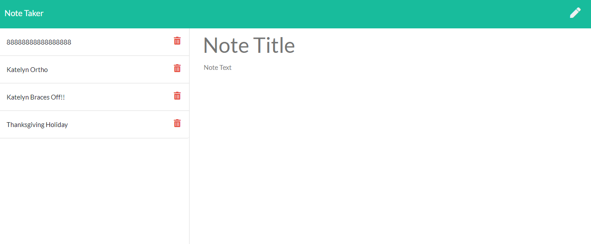
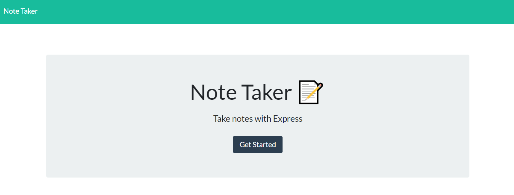

https://vast-sea-58825.herokuapp.com/
https://github.com/cbush2014/Express-Note-Taker

https://vast-sea-58825.herokuapp.com/

# Homework-11-Express Note Taker  

  

## Table of contents
* [General info](#general-info)  
* [User Story](#user-story)  
* [Instruction](#instructions)  
* [Business Context](#business-context)  
* [Acceptance Criteria](#acceptance-criteria)  
* [Screenshots](#screenshots)  

## General info
Create an application that can be used to write, save, and delete notes. This application will use an express backend and save and retrieve note data from a JSON file.

The application frontend has already been created, it's your job to build the backend and connect the two.

## User Story
AS A user, I want to be able to write and save notes
I WANT to be able to delete notes I've written before
SO THAT I can organize my thoughts and keep track of tasks I need to complete

## Business Context
For users that need to keep track of a lot of information, it's easy to forget or be unable to recall something important. Being able to take persistent notes allows users to have written information available when needed.

## Instructions  
[Link to deployed app](https://dashboard.heroku.com/apps/vast-sea-58825) 
(Click on open app)

## Acceptance Criteria
Application should allow users to create and save notes.  
Application should allow users to view previously saved notes.  
Application should allow users to delete previously saved notes.  

## Screenshots
  
  

